**VL53L0X Experiments and Creating a Prototype Mounting Board.**

**January 19, 2021**
  

**Introduction**

I had several reasons for testing the Tof lidar VL53L0X sensor for
distance measurements: First, was the potential to monitor our house
sump pump for failure, in conjunction with an ESP-01 or ESP32 wifi
module, even though continuous monitoring is overkill in this case.
Second, if other potential uses arose, I would have information on the
possible envelope of usability. Third, the cheap price of specifically
this type of lidar sensor, or its longer range brother, the VL53L1X, was
attractive. Although the chips are different, the PCB breakout board
dimension on a number of the commercial boards is the same.

The VL53L0X sensor board used in the test described here was: *Onyehn
VL53L0X Time-of-Flight (ToF) Laser Ranging Sensor Breakout 940nm
GY-VL53L0XV2 Laser Distance Module I2C IIC*. The purchase was based on
price and because the design was similar or exactly the same, as many
other VL53L0X PCB boards. As for quality, the sensor worked out of the
box after soldering the headers. Of course, there was zero information
on set up and use. Fortunately, there is lot of online guidance, and
even the reviews on Amazon served as useful information sources.

For just about any application, it would be prudent to not have the
VL53L0X chip directly exposed to the environment. This is especially
important for any dirty environment, but unless you are living in or
monitoring a research or industrial clean room, I suspect the exposed
emitter/collector will likely degrade in performance over time. So some
sort of sealed or encapsulating mount with an optically clear window is
a necessity. Part of this project was an attempt to design and test a
covering
mount.
  

**Initial Ranging Experiments**

The first set of distance experiments were performed with the VL53L0X breakout board held in an DIY adjustable, vise-like holder previously described for HC-SR04 sensors. The holder's design and construction can be found at *[GaryDyr](https://github.com/GaryDyr)/[HC-SR04-beam-tests](https://github.com/GaryDyr/HC-SR04-beam-tests)*. The holder affords a quick way to lock in various breakout boards for testing different modules and sensors. A top down view of the encapsulated sensor in the holder can be seen in Figure 13. The chip face was adjusted to be parallel with the face of the targets, and perpendicular to the imaginary centerline extending from the chip face to the targets. 

Several targets were used:

1. White, translucent Plexiglas sheet, with smooth, glass-like face, 19 3/8" x 40 3/8" x 1/4", mounted long side vertically. 

2. ArtSkills poster sheet, 22 x 28 inches (55.8 cm x 71.1 mm), PA1510 1510-0419 PKG, with one face coated, glossy white, and the other a smooth, white, paper surface, mounted vertically. The paper face was a little rougher than a typical sheet of paper, with a whiteness estimated by eye against a 92% whiteness sheet of paper to be between 85-95% whiteness.

3. MDF hardboard, 1/8" thick, 16 x 20 inch (40.6 x 50.8 cm) with a smooth, shiny side, possibly coated with a thin coating of some sort to provide a very smooth surface; color was a light brown. The sheet was mounted with long edge horizontal. (This was the backing plate from a picture frame.)

4. Polystyrene insulation sheet, Foamular 150, 30" x 30" x 1" thick, painted flat black; surface was "rougher" than any of the other targets.

5.  Clear water.

With the exception of the water, which is a separate set of tests, the targets were all mounted to ensure the sensor beam centerline would be coincident with the center of the sheet. With respect to the sensor board, which was mounted with the face vertical, all the targets were checked to be vertically 90 ⁰ within +/-0.3⁰, using a saw blade angle measuring device, and probably within 1⁰ laterally to sensor centerline. In all cases, before taking data, the target angles relative to the sensor were changed slightly on the order of a few degrees, to see if there was any measurable variation due to a mismatch between the target and sensor. No noticeable variations from the equilibrium position were obvious.

A tape measure was placed on the floor and set to measure the actual distance from the face of the VL53 chip to the target face. Distance measurements are within 1/16" (~1.6 mm). (The set up was identical to that described in [*HC-SR04-beam-tests*](https://github.com/GaryDyr/HC-SR04-beam-tests).) To avoid parallax issues, a yardstick was placed against the target surface, and tape measure to get the measured distance accuracy.

Assuming the field of view specification of 25 degrees found in the *[World's smallest Time-of-Flight ranging and gesture detection senso](https://www.st.com/resource/en/datasheet/vl53l0x.pdf)r* datasheet by ST, the VL53L0X sensor chip maker, at all measured distances, the entire beam would have intersected the targets and been reflected back toward the sensor. This was checked by using the trigonometric formula (*Lateral distance) =* *(measured distance from chip) x (tangent of 27 degrees in radians)*. Of course, because of beam spread, and some level of diffuse refectance, only a small fraction of the reflected light would reach the sensor.

The room was maintained in a semi-dark condition during all runs, There was no direct light on the sensor, only diffuse light from a small window with a set of closed mini blinds, and light from the computer monitor that was at right angles to the sensor. There was enough light to see in the room without stumbling. However, it was noted that even with normal, indirect light in the room, there was no evident change in the sensor readings. 
  

**Arduino Circuit and Program** 

An Arduino Uno R3, the VL53L0X sensor, and a 1602 LCD Display already soldered to a I2C adapter board, were the only components used. The mixed circuit diagram below indicates the connections:

*Figure* *1: mixed circuit diagram of Arduino Uno R3, a 1602 LCD display
with soldered I2C adapter, and
VL53L0X.*

The Arduino Uno R3 breaks out two sets of pins for I2C , A4 or pin 27 for SDA, and A5 or pin 28 for SCL. For convenience, all were used. The connections are as shown.

<table>
<thead>
<tr class="header">
<th><id="lcd-i2c-pin">LCD I2C PIN</th>
<th><id="arduino-pin-1">ARDUINO PIN</th>
</tr>
</thead>
<tbody>
<tr class="odd">
<td id="gnd">GND </td>
<td id="gnd-1">GND </td>
</tr>
<tr class="even">
<td id="vcc">VCC </td>
<td id="v">+5V </td>
</tr>
<tr class="odd">
<td id="sda">SDA </td>
<td id="a4">A4 </td>
</tr>
<tr class="even">
<td id="scl">SCL </td>
<td id="a5">A5 </td>
</tr>
<tr class="odd">
<td id="section-8"> </td>
<td id="section-9"> </td>
</tr>
<tr class="even">
<th id="vl53l0x-pin">VL53L0X PIN </th>
<th id="arduino-pin">ARDUINO PIN </th>
</tr>
<tr class="odd">
<td id="gnd-2">GND </td>
<td id="gnd-3">GND </td>
</tr>
<tr class="even">
<td id="vcc-1">VCC </td>
<td id="v-1">+5V </td>
</tr>
<tr class="odd">
<td id="sda-1">SDA </td>
<td id="a4ref-27">A4REF; 27 </td>
</tr>
<tr class="even">
<td id="scl-1">SCL </td>
<td id="a5ref-28">A5REF; 28 </td>
</tr>
<tr class="odd">
<td id="gpio">GPIO </td>
<td id="not-used">NOT USED </td>
</tr>
<tr class="even">
<td id="shut">SHUT </td>
<td id="not-used-1">NOT USED </td>
</tr>
</tbody>
</table>

 The module connections were set up on a breadboard for testing, with the Uno connected to a PC running Windows 10. 
  

**Arduino Sketch and Data Collection**

The sketch for obtaining the data is *LaserTOF\_vl53L0X-LCD.ino* and can
be found in this repository. The Arduino IDE was used to run the sketch.

The LCD display allowed easier display of what distance changes were
occurring, compared to trying to see the data streaming on the Serial
Monitor some distance away from the circuitry, but otherwise the LCD
display is superfluous. Sensor distance values were copied from the
serial monitor by highlighting the stream of values, using CTRL-C to
copy the data, and pasting into an Excel 2007 worksheet for analysis.
Generally, 1000 points were collected and averaged, but in a few early
runs, over 2000 were collected.

The main reason for the shift to a smaller number of points was that the
data was collected at 4 Hz, so roughly 4 minutes of collection time per
run. Data could be collected at higher rates, according to ST
specifications, as fast as 30 Hz, depending on desired accuracy. The
problem was the LCD Display ten's and unit's position changed so fast,
it was impossible to see what was going on, so the data rate was lowered
to make the display more readable. (A higher rate of data collection
could have been decoupled from the LCD display by using an inner loop
that only printed every nth value to the LCD display, or with an array,
averaged and printed.) There should be sufficient comments in the sketch
to make clear most of the code. The Arduino vl53l0x library by Polulu
was used, because it seemed to afford the widest selection of the ST API
commands.
  

**Results and Discussion**

Below is a plot of VL53L0X distances measured against values measured
mechanically using a tape measure, for the five different target
surfaces described above along with a linear theoretical correlation
line.

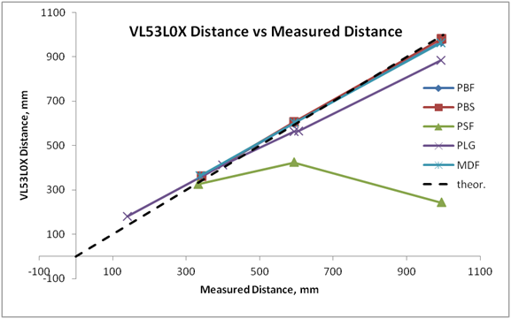

*Figure* *2: comparison of different target VL53L0X distances versus
tape measured distances.*

*Target Key for above plot:*

PBF = flat paper-like side of poster board

PBS = shiny, coated side of poster board.

PSF = polystyrene insulation foam painted flat black, medium rough
surface - 1" thick.

MDF = medium density fiberboard, very smooth, maybe coated face, color
medium brown , 1/8"

PLG = translucent acrylic Plexiglas sheet 1/4 " thick,

The black polystyrene foam target (PSF) is a dramatic outlier. It shows
the effect a rough textured surface can have on distances. The texture
was not pebbly, but was certainly rougher than any of the other targets.
The rough surface means a higher ratio of diffuse: specular reflection,
with a likely higher loss of light reflecting back to the sensor
collector. It is not clear whether the flat black paint used to cover
the surface was also an issue at 940 nm. Whatever the combination of
reasons, this target shows how complex sensor distance readings can end
up, where the same ToF reading may represent two or more widely
separated real distances.

For the remaining targets, the white translucent Plexiglas sheet (PLG)
was also a surprise. Despite its smooth, highly reflective surface, the
sensor distances exhibited the next highest deviation from the true
distances. Also, at the longest distance, 913 mm, this target had 26% of
the total readings out of range, reflecting a higher variance. Why this
target had such an unusual behavior is not obvious. It may have to do
with diffuse scattering of light some distance within the plastic that
produces the translucence, such that a much large fraction of light is
diffusively reflected compared to other surfaces, resulting in much less
light returning to the sensor.

None of the targets intercept's go through the origin. In the most
linear with distance response cases, PBF, PBS, and MDF, linear
regression lines intercept in the range 40-56 mm, suggesting that the
sensor distance measurements are not best fitted by a simple least
squares regression line. The closest correlation is with the highly
reflective, shiny side of the poster board (PBS). However, the data
range is based on a very limited number of values and all three linear
correlations are quite close.

The distance differences for the 3 best cases indicate that at a maximum
~ 1 m, the maximum difference from the true distance is less than 7.4%.
The best case is the white poster board with the shiny face the best of
all, i.e., - 1.5 % (1.5 cm) at 1 m. At 60 cm, the error values for any
of the three best targets become less than 5 mm. Even the Plexiglas is
nearly in this range at the 60 cm.

Even though the sensor is capable of measuring up to 2 m, no long range
mode experiments were done; all runs were normal mode, which means a
maximum distance of 1.2 m. However, at that range, even the best
reflecting targets begin to exhibit many out of range drop outs. The
maximum values discussed here range up to 1 meter, without exhibiting
drop outs, with the exception of the translucent Plexiglas and the
polystyrene
sheet.

Another measure of the dispersion of values can be seen from the plot of percent difference in distance between the sensor distances and the measured distances. Only the three cases which exhibited a close relationship to the measured distance, both sides of the poster board and the MDF, are shown.
 

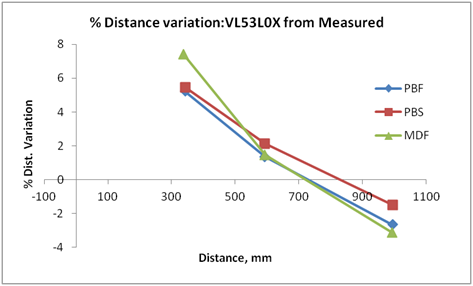

*Figure 3: percent of variation in sensor distance from measured
distance.*

This plot emphasizes the drop off of sensor distances relative to the
actual distances. The curvature of all the plots for all three targets
and the fact none of the target have linear lines going through the
origin suggest a nonlinear distance correlation. Therefore, the best
technique for distance measurements with the sensor is to create a
calibration curve using the intended target over the expected range.
There are numerous ways to do this, using direct or interpolation tables
derived from curve fitting data such as a LOESS (locally estimated
scatterplot smoothing fit), or using one of the plethora of curve
fitting model equations to fit the sensor data to the desired accuracy.
As we will see later, this is an absolute necessity if the sensor is
behind a protective window of some sort. Although certainly not proven,
these differences between measured and sensor distances suggest the
percent standard deviations reported in the ST specifications are in
line with the above differences. It was easy to use Excel's built-in ,
trendline function to fit the data going through the origin, with high
correlation coefficients, but with the very limited number of points to
fit in each case, the results were not worth reporting.

Why the distances below about 800 mm are higher than the measured
distances is not clear. It may have to do with how the sensor was
calibrated. The ST API discusses how to recalibrate the sensor, and
there are example sketches to do this that can be found online. The
sensor here was used as delivered.

With respect to the error range of the sensor data, the variation of the
standard deviation with distance is shown below for the three most
stable cases, the poster board surfaces and the MDF:

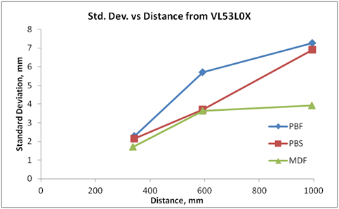

*Figure 4: change is standard deviation with distance for three best
distance correlating
targets.*

These standard deviations are for the sensor measurements, not between the measured distance and the sensor distances. (There were no repeat experiments to derive the standard deviations between measured and sensor distances.) The variation are not very large. In all cases, there is an increase in standard deviation with distance from the sensor. A Q-Q plot (not shown) of a run with 2000 sensor readings indicated that the sensor distance values are normally distributed around the mean. Thus, the standard deviation calculation for a normal distribution is a reliable measure of the spread in values for the sensor. In terms of % standard deviation, all the data is less than 1%. At maximum range, there is a +/-7 mm standard deviation, and at the low distance end, 340 mm +/-2. mm. 

There were two additional runs with only single point data: A run was
done with no target in range. Values ranged from 0 to a maximum of 71
mm, with an average of 16 mm, and a standard deviation of 17.9 mm. I am
not sure how to interpret this, other than random noise measurements. In
the second case, a flat aluminum flashing sheet was used as target at a
single distance. As with any flashing, this is a moderately reflective
target with a dull finish. At a distance of 813.4 mm, the VL53 sensor
response was 812.8 mm, with a standard deviation of 3.5 mm, So this
target would be expected to behave very similar to the best targets
discussed above.
  

**Effect of a glass cover on VL53L0X distance measurement**

In real applications, where the sensor is intended to work over more
than just an experiment fun phase or testing phase, it is hard to
imagine a case of long term use, where a bare VL53L0X chip would not
experience some degradation of distance through normal everyday
onslaught of environmental conditions. Of course, the amount of time
before distance measurements become intolerable, depends just how dirty
the environment is with oils, greases, aerosols, dust, possible splashes
from liquids, or even skin cells. Thus, some protection of the sensor
itself is necessary for any real use. Any protective cover, no matter
how clean and transparent must have some impact on the transmission and
reception of the laser pulses.

The last section of this article describes the construction of a DIY
protective cover mount or fixture that adds a protective glass cover to
the sensor. Distances were measured with the same setup as above, but
only the poster board paper side was used.

In retrospect, it would have been prudent to wear clean cotton or latex
gloves when cutting the glass cover slips to eliminate fingerprints. The
glass would still need to be cleaned, but it would have minimized one
obvious contamination source. The first set of runs was done with a
half-hearted attempt to clean the glass cover slips, with 70% isopropyl
alcohol. This has to be done with little pressure applied to the glass,
to avoid breaking the very thin slips (0.13 mm). The glass did not
exhibit any obvious contamination. However, the isopropyl alcohol was
old, which could have introduced oxidation products, which might
contaminate the isopropyl alcohol, and leave a film that was not
obvious.

The results of the first distance measurements were less than
encouraging. Knowing that the glass cleanliness is a critical factor,
denatured alcohol with a cotton swap was next used to clean the glass.
Unfortunately, the glass ended up with a lot of tiny cotton fibers. A
rolled piece of newspaper was used to remove any trace of the fibers,
and wipe down the slips. Of course, denatured alcohol is not the same as
high purity or analytical grade ethanol. Depending on what denaturing
agents are added, they could leave a residue on the glass. The results
from these runs are displayed below.

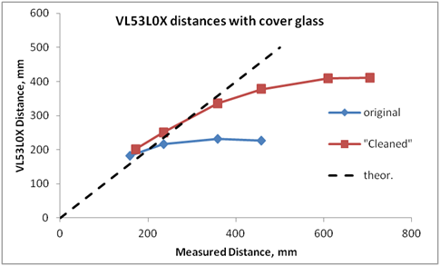

*Figure 5; sensor distance versus true (manually measured) distance for
cleaning with contaminated isopropyl alcohol, then denatured ethanol.*

The "original" run was after cleaning with the likely contaminated 70%
isopropyl alcohol. The "Cleaned" run was after cleaning with denatured
ethanol. The distance data suggest that indeed the isopropyl alcohol was
contaminated. The ethanol cleaned glass data show a much better distance
response. However, even that run indicates a near linear maximum
distance range nearly one half the range with no glass protector (Fig.
2). No further attempts were made to clean the glass.

This data is similar to the case shown in the AN4907 ST application
note. At best, with the demonstrated mounting system, it would be
prudent to only use the sensor to about 50 cm, even with a calibration
curve. In the dirtiest case, the sensor is not useful past 20 cm. Once
again, we see that the distances from the cleaned sensor at short target
distances are consistently greater than the measured distance, which is
the same behavior as with the unprotected sensor.

All the data, up to the maximum distance ranges exhibited no dropouts,
e.g., out of range measurements, which suggests that the readings are
being dominated by internal reflections and refraction issues from the
glass and possibly the mounting plate edges around the glass.

As with the unprotected sensor, a run with no target was done. A
distance of 81.2 mm, with a standard deviation of +/-2.6 mm was found.
Again, it is not clear how to interpret what this distance means. This
value is 5 times larger than the no target case with the unprotected
sensor. However, the much lower standard deviation of this data,
suggests that whatever leads to the offset from zero distance has
something to do with the glass window.

This is a case of the real being an enemy of the good. It is hard to
imagine a case of long term use, where a bare VL53L0X chip would not
experience some degradation of distance in a normal everyday environment
over time. Of course, the amount of time depends just how dirty the
environment is with oils, greases, various aerosols, dust, skin cells,
etc. Any protective covering must have some impact on the transmission
and reception of the laser pulses. Clearly, for long term use, some sort
of cleaning regimen is a necessity, along with some sort of periodic
calibration process to make sure the readings are still reliable.

**Glass Covered Sensor. Comparison of water target and white paper
target**

Online searching found several blogs and a number of forum posts related
to questions or attempts to use the VL53L0X for water, or other liquid,
height measurements. Most of those who tried to use the sensor to
measure liquid levels did not do so with any kind of protective window
over the sensor, and most did not report distance correlations. As
explained in the **Introduction**, measuring liquid level was one of my
interests in the sensor.

I decided to try a quick set of experiments with my DIY glass covered
sensor, even though the previous data suggested that there is definitely
a reduced range with a glass cover. As already mentioned, for any
lengthy use of the sensor, I find it hard to imagine relying on a bare
sensor, unless willing to replace it, or check its calibration on a
regular basis. And considering the environment a sump pump is usually
in, it is even harder to imagine using an unprotected sensor.

The encapsulated sensor was mounted pointing down at the intended
target. The target was a modified beaker (Kontes LABMUG™ with a diameter
of 7 cm) filled with water to a depth of 25.4 cm. \[ Any wide, deep
container will do, such as a vase, but the beaker mug added
semi-scientific respectability to the test ;) \]. Under the beaker, a
white sheet of regular printer paper (92% whiteness) was placed as a
secondary reflecting surface, in case the water turned out to be
transparent to the beam. The beaker was then moved to several different
heights and 100 readings taken (modifying the number of sensor readings
in the previously mentioned sketch). As a control experiment, the white
paper target was measured at several points close to those of the water
levels. As with the previous measurements, no out of range values were
identified in the data stream. The results are displayed below.

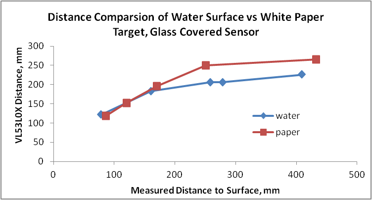

*Figure 6; water level measurements for encapsulated sensor, and
comparison with white print paper
target.*

The paper target data is reasonably consistent with the previous large white board measurements using the protected sensor, suggesting that beyond 30 cm, the error in measurements will have a greater impact on the reliability of the distance, even with a calibration curve. However, these sensor readings are quite a bit lower at the maximum distance by about 100 mm, than the large poster board target. The reasons for the difference between the previous data and this current data are not clear, it could be reflectivity, or surface difference, or some minor misalignment of the sensor and paper target, even though misalignment was checked by slightly moving the sensor off normal to see if values were affected. Even the water and paper-only data seem to approach one another at small distances. Both sets of data are larger than the measured distance by 14 to 56%. Why they are greater is not clear, but the data is consistent with all other measurements. This may be partly a consequence of whatever also creates the high no-target reading. 
 

Because of concern at the longer distance that maybe the beam detection width had been exceeded. the target was changed to a large white bowl with a diameter of approximately 15 cm, filled with water. The sensor reading in the figure at 278 mm is the sensor distance for this change in container; it is basically the same as the 258 mm value from the beaker, so the beam width of the sensor was not a significant factor in the measurements, if at all.

The good news is that it is possible to measure the distance to the surface of water. The bad news is that the drop off in reliability occurs at even shorter distances. it is possible to maybe get values out to 30 cm, but we must clearly expect the distance errors will be larger. The standard deviations at the higher values were approximately 2.5 mm. From the water target data the difference measured by the sensor between the last two points is only 20 mm, while the true distance was 151 mm. Because of this nearly 8 fold difference, using a calibration curve to extend the useful range, will inevitably lead to much higher errors, suggesting averaging as many measurements as possible in each measurement cycle would be good practice.
  

**Conclusions**

I believe the sensor distance results are typical of what to expect with just about any of the VL53L0X sensor boards. Much of what ST describes in their datasheet and application notes, seems to be in line with the performance data I collected. So there were no real surprises. My goal was not to reproduce their data, so there is no direct comparison. For instance, I do not have 17% or 88% grey level cards to check the calibration. I do not believe that my specific board from Onyehn is any better or worse than other suppliers, with similar design.

The different experiments that were done offer some idea of what anyone might expect under similar conditions. Certainly, my sealed cover mount may not represent the most fastidiously optimized mount and especially maximum optical transmittance (clean) windows, so that correlations between sensor and true distances could be somewhat better. However, as the specification and data provided by ST suggest, a calibration curve is a must, and that the maximum range will be reduced by an window material. 
  

**Protective encapsulating mount for VL53L0X board**

As suggested by the above data, the seeming simplicity and convenience
of the VL53L0X ToF sensor board overlooks a big issue of protecting the
sensor from the environment. ST, the VL53 chip manufacturer, clearly
recognizes the problem and has a detailed application note discussing
the issues. *VL53L0X ranging module cover window guidelines [AN4907.fm
(st.com)](https://www.st.com/resource/en/application_note/dm00326504-vl53l0x-ranging-module-cover-window-guidelines-stmicroelectronics.pdf)*
. Reading this document is a must for anyone considering long term use.
It is very well written.

If you search "VL53L0X 3D printer" online, a variety of models comes up.
Most of these homemade mounts do not have any provision for a protective
cover. There are commercially available cover mounts that cost more than
the commonly available VL53L0X boards themselves. One of these, by
Hornix is explicitly mentioned in AN4907. The commercial fixtures, e.g.,
<http://www.hornix.com.tw/en/product-list-3/> for one**,** are made from
either optical grade PMMA (Plexiglas, or more generically:
polymethylmethacrylate, or acrylate), or polycarbonate. I also found
[this](https://www.gilisymo.com/cover-glass/21-vl53l0xcoverglassroundnoglue.html)
site (gilisymo) with covers, but it is not clear if this is a supplier
of the Hornix versions, or an independent
source.

There are two classes of commercial mounts. One type does not have any provision for crosstalk (explained below), another version appears to recognize the crosstalk issue. From a DIY perspective, working with either the polycarbonate or PMMA sheets would be much easier and less delicate than working with a glass cover slip. However, sheets of these materials that are very thin (\< 0.5 mm) and optical grade are not readily available off-the-shelf. The commonly available thin sheets are 1/32" (0.8 mm) which is really pushing the thickness envelope that the ST application note recommends for a cover mount.

The alternative is glass cover slips. These come in a variety of sizes and thickness. However, working with these has their own set of issues, which will be discussed later.
 

Given the cost of the commercial mounts, it seemed reasonable to first see what I could do from a DIY perspective, and to get an idea of how a cover affects the chip distance performance.

ST discusses a common issue with a protective cover that is termed
"crosstalk". When the emitter laser beam hits a transparent cover plate
of some material, some of the light is reflected off the first and
second glass surfaces and via multiple external and internal reflections
can hit the collector sensor, causing false readings. The application
note discusses ways to reduce the problem. Most of the discussion
revolves around a single cover window over both the sensor collector and
emitter.

An online video by ST discussed an advanced fixture approach for a
protective window, [VL6180X: Calibration-Free Dirty Environment Cover
Glass Solution - YouTube](https://www.youtube.com/watch?v=7INefyjvvdI),
but with the VL6180X, which has a much smaller range. In this fixture, a
partition is used between the emitter and collector windows with two
separate cover slips. In this case, the partition effectively stops any
reflection and refraction crosstalk along any surface of the cover plate
that could affect the collector. The 3D *.stp* printer file of the
fixture can be downloaded from
[https://www.st.com/en/imaging-and-photonics-solutions/vl6180x.html\#cad-resources](from%20https:/www.st.com/en/imaging-and-photonics-solutions/vl6180x.html%23cad-resources).
(Note that the VL6180X has a different footprint than the VL53L0X chip.)
This fixture appears to be most applicable to the ST development board,
but the principle applies to any fixture/mount. I found it notable that
ST does not discuss how the cover glass was made to fit their fixture.
As you will read, this is a tedious operation. (The commercial covers
can be obtained with apparently either a single or split, "advanced"
window.)

There are many guidelines in the AN4907application note. These will not
all be discussed, but there are several that are immediately relevant
for this project:

  - The covering material must be optically transparent to 940 nm
    infrared, clear through, and without a rough surface.

  - The cover must be flat and coincident (parallel) to the VL53L0X
    chip.

  - The combination of an air gap between the sensor chip and cover, and
    cover thickness must be kept as small as possible, \<= 1 mm at most,
    to achieve maximum sensor
range.
 

The first stage was to get a good set of measurements for the VL53L0X PCB board and sensor chip. The dimensions of the sensor chip itself are provided by ST. The sensor board I used, which is a version commonly found, is shown below: Note that you can just make out the emitter and collector in this picture

 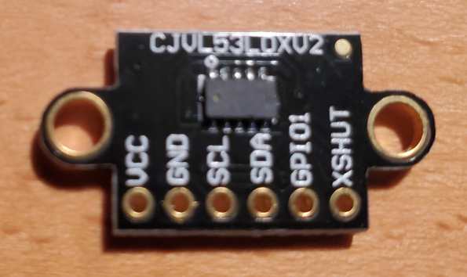

*Figure 7; VL53L0X sensor board*

Below are the measurements taken from this board. (Top edge is taken as shown in the image, with board ID at top and pin headers at bottom.) From visual images of other chip suppliers, I would suspect the boards have the same, or very similar measurements.
  

**VL53L0X measurements:**

<table>
<thead>
<tr class="header">
<th id="inches">Inches </th>
<th id="mm">Mm </th>
<th id="description"> Description </th>
</tr>
</thead>
<tbody>
<tr class="odd">
<td id="section-26">0.788 </td>
<td id="section-27">20.08 </td>
<td id="mounting-hole-to-hole-center.">mounting hole to hole center. </td>
</tr>
<tr class="even">
<td id="section-28">0.911 </td>
<td id="section-29">23.14 </td>
<td id="mounting-outer-hole-to-outer-hole">mounting outer hole to outer hole </td>
</tr>
<tr class="odd">
<td id="section-30">0.671 </td>
<td id="section-31">17.04 </td>
<td id="mounting-inner-hole-to-inner-hole">mounting inner hole to inner hole </td>
</tr>
<tr class="even">
<td id="section-32">  </td>
<td id="section-33">3.04 </td>
<td id="calculated-mounting-hole-size">Calculated mounting hole size </td>
</tr>
<tr class="odd">
<td id="section-34">  </td>
<td id="section-35">10.04 </td>
<td id="calculated-board-center-to-mounting-hole-center">Calculated board center to mounting hole center </td>
</tr>
<tr class="even">
<td id="section-36">0.983 </td>
<td id="section-37">24.97 </td>
<td id="board-mounting-ear-edge-to-opposite-ear-edge">Board mounting ear edge to opposite ear edge </td>
</tr>
<tr class="odd">
<td id="section-38">0.621 </td>
<td id="section-39">15.77 </td>
<td id="board-length-rectangle-section">board length rectangle section </td>
</tr>
<tr class="even">
<td id="section-40">0.5 </td>
<td id="section-41">12.7 </td>
<td id="board-width">board width </td>
</tr>
<tr class="odd">
<td id="section-42">0.079 </td>
<td id="section-43">2.01 </td>
<td id="top-board-edge-to-vl53-pin-headers">top board edge to VL53 pin headers </td>
</tr>
<tr class="even">
<td id="section-44">0.252 </td>
<td id="section-45">6.40 </td>
<td id="top-board-edge-to-vl53-pin-headers-nearer-center">top board edge to VL53 pin headers nearer center </td>
</tr>
<tr class="odd">
<td id="section-46">0.384 </td>
<td id="section-47">9.75 </td>
<td id="top-edge-to-8-pin-header-edge">top edge to 8 pin header edge </td>
</tr>
<tr class="even">
<td id="section-48">0.173 </td>
<td id="section-49">4.4 </td>
<td id="vl53l0x-chip-length-from-st-specs">VL53L0X chip length, (from ST specs) </td>
</tr>
<tr class="odd">
<td id="section-50">0.0945 </td>
<td id="section-51">2.4 </td>
<td id="vl53l0x-chip-width-not-including-pins-from-st-specs">VL53L0X chip width, not including pins, (from ST specs) </td>
</tr>
<tr class="even">
<td id="section-52">0.177 </td>
<td id="section-53">4.5 </td>
<td id="square-hole-to-fit-over-chip-pins-with-0.1-mm-clearance-4.4-0.1">square hole to fit over chip &amp; pins, (with 0.1 mm clearance) 4.4 + 0.1 </td>
</tr>
<tr class="odd">
<td id="section-54">0.122 </td>
<td id="section-55">3.1 </td>
<td id="top-edge-to-vl53-chip">Top edge to VL53 chip </td>
</tr>
</tbody>
</table>

 
The chip height specification is 1 mm. According to the ST application
note, a mount must fit over the chip so that the air gap is as small as
possible, but does not touch the chip. My idea was to create a two piece
"sandwich" plate to hold the glass covers, The bottom plate would be cut
out to fit over the VL53L0X sensor chip and its surface mount solder
pins, keeping the top cover plate parallel to the VL53 chip. The top
plate would have two separated holes, one for the emitter and one for
the collector. Although it was possible to just have two mounting holes
for assembling the mount to the sensor board, I decided that four holes
would give me more opportunity for subsequent mounting on other
supports. Here is a drawing of what I hoped I would end up with Fig. 8):

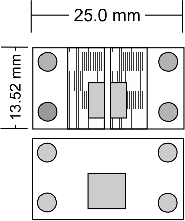

*Figure 8; sensor sealing and encapsulating mount.*

The hole dimensions can be found or garnered from the measurement table.
The grey areas represent holes through the mounts, the long rectangular
areas in the upper mount represent slots cut to hold the glass cover
slips in place. The slots are designated as 1/4" wide, only because that
is the smallest diameter router bit I have.

As for mount material, searching through my maybe-useful-in-future junk
pile, I found a piece of PCB salvaged from a piece of electronic
equipment. The PCB was 0.057 inches or 1.44 mm thick. After cutting a
section from the much larger board, the most clear section I wanted had
only one mounting holed drilled in it. Using double sided tape, I
mounted the PCB board, edge to edge flush, to a small block of
engineered scrap flooring. This image below shows the board and the
final result of routing and drilling the board. Note that there are two
sets of mounts being created, with the intent of hopefully getting one
good set.

*Figure 9; mount layout on scrap piece of PCB board cut from larger
board, and sealed to backing flooring with double sided tape.*

You can just make out the wood flooring on the left. I ended up removing
the top layer and copper on the underside of the PCB board to reduce the
thickness of the board, before tapping to the board, but this was not a
great idea. It was very difficult to maintain a flat board during wet
sanding with 240 grit wet/dry paper. There was some curvature at the
edges.

Through Amazon, I purchased a set of 100, 22 mm x 22 mm x 0.13-0.16 mm
microscope cover glass slips, So the first operation was to cut the two
1/4" x 0.13 mm slots for the glass cover slips on the top plate. This
was done with my router, a 1/4" carbide router bit, and my router table.
My router and router table are not precision pieces of equipment, but
with trial and error tweaking, I was able to get approximately a 0.13 mm
deep slot, or at least deep enough so the cover slips were coincident
with the board surface. Scrap pieces of flat wood were used to check for
the right distances and depth before routing the PCB board. Not all went
exactly as laid out, I should have used a longer piece of wood to hold
the PCB board. If you look closely you can see a spot where I went off
the intended straight track just a bit, because I needed a longer length
of backing wood against the router fence.

 
Using an all, or a \#22 hobby blade, I scratched out the hole centers,
and cut outs. I used a sharp lead pencil to help highlight the
scratches, and center punched for the holes to be drilled. For the
bottom plate that fits over the VL53 chip and its header pins, I drilled
out the section using an "L" size letter drill, and used a Dremel 1/16"
router bit in my Dremel tool to manually square up the hole. You can
just make out one of the holes about the half way point of the PCB
board. I did not do the greatest job of squaring up the hole. I kept
forgetting this should be tedious, slow work. However the holes were
sufficient to leave the VL53 chip and it's pins exposed. The top plate
sensor holes where of some concern, The gap between them needed to be 1
mm or less, and the holes needed to be large enough to not impede the
laser emitter and collector. I used a 1/8" drill bit to drill the holes.
It sort of worked out, but I found that needed to expand the holes in
both directions. Particularly, the emitter and collector were exposed,
but not enough based on the exclusion areas that ST required.

 
All the board mounting holes where then drilled, using a 0.120" (3.05
mm) drill bit. Again, I should have taken a bit more time when
measuring, counter punching, and aligning the drill bit. Some of the
mounting holes did not completely line up, with each other and the
mounting holes and had to be "fixed" with the 1/16" Dremel router bit.

 
On the top plate, I wanted square holes above the sensor emitter and
collector, but in the end that was not practical.

Finally, using my oscillating tool, I cut the pieces out of the board,
and filed and sanded the edges. Below is the result of all this work.

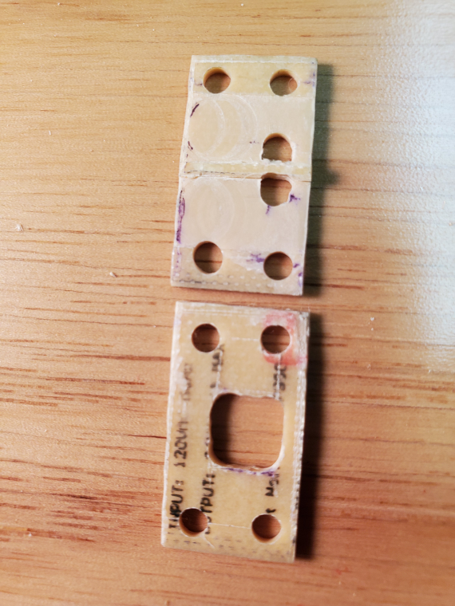

*Figure10; completed sensor mount. lower piece fits over sensor and its
flush mounted pin. Upper section has two holes centered over light
emitter and collector.*

In the final fitting, some of the mounting holes had to be enlarged
because of sloppy drilling. This is one of the two sets that I made from
the breadboard. This set was not used because in attempting to file out
a bit more of the center light barrier in the top holder, I applied too
much pressure and the center divider broke out near the edge. However,
it shows how the holes were arranged and the fact that I missed drilling
the holes accurately, and had to resort to the Dremel router bit to
expand a few holes, including the sensor holes.

The estimated path from the sensor is an air gap of \< 0.2 mm, with a
glass cover slip ~ 0.13 mm thick.

Obviously, I am blessed with sufficient tools (albeit, maybe not the
desired level of skill and patience) to do this. Because of the small
size, this is tedious work.
  

**Cutting the glass cover slips**

Now we get to the REALLY tedious stuff. As already discussed. I needed
two glass cover slips approximately 1/4 inch wide, and roughly 13 mm
long. Anyone who wants to try their hand at a similar project using
cover glass slips MUST read this reference as a starting point: [Making
and Using Micro Cover Glass
Squares](https://www.mccrone.com/mm/making-micro-cover-glass-squares/)
(<https://www.mccrone.com/mm/making-micro-cover-glass-squares/>). I read
the transcript and watched this video a couple of times. I also ended up
ordering a set of cheap diamond styluses, which were really for a rotary
glass etching tool.

I made my own holder for manual scoring. The stylus shafts were 3/32". I
had a 6" long piece of hexagonal brass stock, and using my lathe, I
drilled a 3/32" hole into the shaft. A side hole was drilled and tapped
so I could lock in the stylus with the locking screw supplied with the
styluses. I used the diamond bit with the sharpest point. (I am not sure
if the point tip itself was actually diamond, but it did the job.)

 
Instead of a glass table surface as suggested by the McCrone document, I
used a 1/4" thick, 6" x 3" sheet of clear scrap Plexiglas. For a
backstop, I had a scrap piece of 3/4 engineered flooring attached to a
piece of 2x4 at right angles; the flooring acted as a back support when
I applied lateral pressure to score the glass. I used a second piece of
scrap plastic as my ruler edge. I drew two lines on the wood below the
Plexiglas that were the required 1/4" width glass covers I needed to
cut.

 
There is plenty of finesse needed to learn to cut the glass slips. I
wasted six cover slips with multiple cuts on each and produced a pile of
fine glass chips, before I even began to get the technique right. The
learning phase consists of striking a balance between the right scoring
tool angle and the right stylus pressure, to score the glass without
excessive pressure shattering the slip, yet make a continuous scoring
line. As with any manual tile cutter or glass cutter hand tool, it is
not advisable to make repeated swipes. A single scribe line, using the
same constant pressure along the entire line is what you want to
achieve. As suggested by the McCrone information, I found holding the
diamond stylus at a high angle, somewhat less than 90 degrees (probably
between 80-85 degrees and pushing the stylus from the glass edge closest
to me to the far edge worked best. You know you will get a good scoring
line and potentially a good, clean break, when you hear and feel the
scratch. To break at the score, I sandwiched the slip between two pieces
of plastic at the scoring line. You need very even pressure across the
slip to get a clean square break at the scoring line. In some cases, I
used a small piece of plastic to apply even pressure along the exposed
glass section. To get a good selection of glass covers, I used probably
a dozen cover slips. My main issue was getting the width just right. if
the length was a bit smaller, it is not an issue once glued and
sandwiched in place. Below are several photos to put a visual spin on
what I was
doing:

 
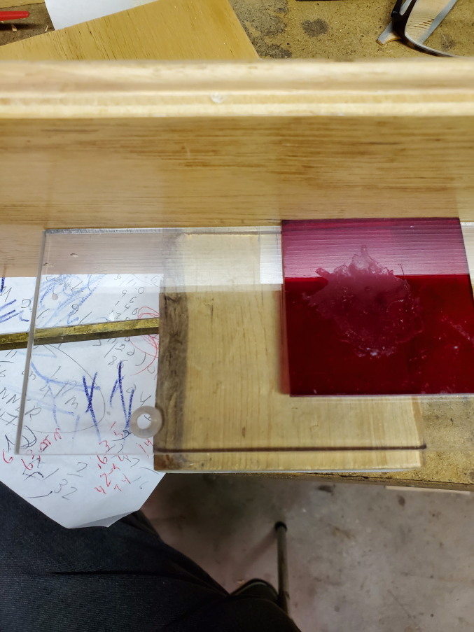

*Figure 11; setup to cut glass cover slips.*

Fig. 11 shows the setup. The back plate at the top is the engineered
flooring, screwed to the small piece of 2 x 4 below. You can see the
large clear Plexiglas "base plate" on top. The red plastic piece was my
"ruler" to steady the stylus. You can just make out next to the ruler,
the reflection from a section of the cover slip, ready for
scoring.

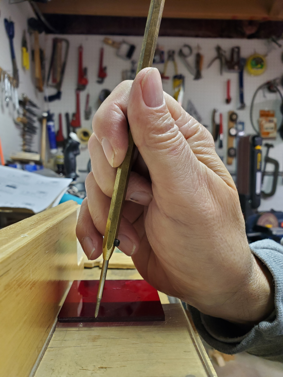

*Figure 12; Angle to hold stylus to etch glass cover slip. The picture
demonstrates the angle, not the correct hand position used.*

 Fig. 12 shows approximately the angle I held the stylus at while
scribing from right to left. The stylus was held more like a pencil when
actually scribing. Trying to take the photo with one hand to show the
angle was the main idea here, not an actual cut. Lighting is also
something that needs to be just right. The cover slips can be difficult
to see.

By the time I finished the learning process and making the proper sized,
unbroken covers, I had gone through at least 12 cover slips.
  

**Assembling the mount and VL53L0X board**

Glass cover slip pieces that extended almost or at the full length of
the holder were placed in the slots of the lower mount. A small dab of
Loctite GO2 glue was placed on the edges to hold the glass in place,
otherwise they will fall out when the two mounts are mated. This is
another tedious operation; a T-pin was used to maneuver the glass cover
slips in place, and add the glue. A small thin amount of glue was also
added to several points on the surface of the top mount to act as a seal
and make the "sandwich" permanent. Of course, in a permanent application
to get a moisture barrier, glue or some sort of sealer would have to be
applied between the two mount pieces to act as a gasket. Below is a side
view of the completed and mounted VL53L0X. Two 3 mm screws were used to
lock the VL530X PCB to the
mount.

 

*Figure 13; top down view of the completed mount and attached sensor.
You can just barely make out the slots holding the glass slips, left and
right of the center bar. The screws re 3mm x 9 mm with hex head.*

 

Below is a face view of the completed mount. the white plastic guides on
each side are the arms of my DIY vise holder. The extra hole on the left
of the mount is an "artifact" from the scrap PCB board, and serves no
purpose other than to look
bad.

 
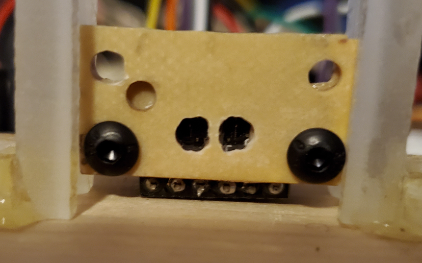

*Figure 14; face on view of mount. The two holes in middle are where the
sensor emitter and collector are. The glass slips are not obvious in
this photo.*

 After finding that the mount "sort of" worked. I decided to do it right
and generate a 3D printable st of mounts, equivalent to my prototype. A
face view of the 3D pattern is
below:

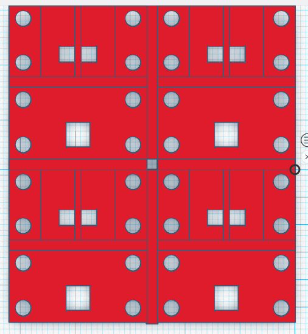

*Figure 15; Tinkercad face view of 3D mount. Four sets of mounts are
created by this design.*

Tinkercad 3D design was used to create the 5.25 x 5.75 cm plate which 4
sets of plates. Between the plates is 0.5 mm thick bridging. With a bit
more work this could have been reduced to a few tabs between the plates
to save material, and make slicing easier.

The 3D .stl printer file generated using Tinkercad can be found in this
repository. I do not have a 3D printer, except through our local
library. I did not print this pattern, so it is untested. It was not
printed, because the range results were not as good as hoped, and I have
no immediate use for the range the encapsulated sensor would provide. To
get an idea of cost and materials, I did try an online slicer, in which
I specified the first layer could be 0.3 mm, and subsequent layers were
0.10 mm. These tolerances are needed, to ensure there is a minimal, but
necessary gap between the glass cover slips, and the top of the VL53
chip. Estimated time to produce the block was 35 minutes, and 43 cm of
material. With modification of the size and position of the inner
openings, this mount would work with many VL53L1X breakout boards as
well.
